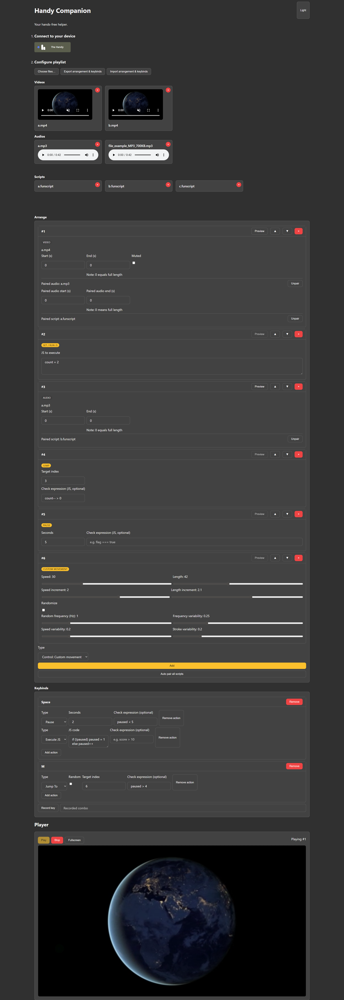

# Handy Companion

A local, browser-based companion app to build and play media arrangements for your Handy device. Load videos, audios, images, and funscripts; arrange them with control segments; preview parts; and drive playback with configurable keybinds. No uploads — everything runs in your browser.



## Features

- File ingestion
	- Choose multiple: Videos, Audios, Images, and .funscript files
	- Simple de-dup by name:size to avoid duplicates

- Arrangement builder
	- Segment types:
		- Media: video, audio, image (image has a duration)
		- Script: .funscript placeholder segment (device execution to be wired in a future update)
		- Control: jump, repeat, set (JS), pause
		- Control: custom movement (UI controls ready; runtime behavior TBD)
	- Reorder, remove, and per-segment edit of trims (start/end), duration, mute
	- Pairings:
		- Pair a script to a media segment
		- Pair an audio to a video or image segment with optional start/end
		- Auto-pair all scripts by base filename matching

- Player
	- Play entire arrangement; status shows current index
	- Per-segment Preview for media (video, audio, image)
	- Trims respected for video/audio (start/end)
	- Image duration respected; optional paired audio loops during image display
	- Video with paired audio: paired audio can loop between start/end while video plays
	- Pause control segment pauses playback for N seconds (with optional condition)
	- Jump and Repeat control segments change flow inside the arrangement
	- Stop at any time; supports fullscreen/pseudo-fullscreen for stage

- Keybinds
	- Record a key combo (Ctrl/Shift/Alt/Meta supported) and attach actions
	- Actions (with optional conditional expression):
		- Execute JS (set): mutate `vars` or side effects
		- Jump To (goto): random or a specific target index
		- Skip: skip i segments; repeated quick presses stack correctly
		- Pause: pause N seconds
	- Conditions and scripts evaluate safely with a proxy so unknown vars don’t throw

- Theme & UX
	- Light/Dark theme toggle; dark theme uses a grey/yellow palette
	- Simple, responsive layout optimized for keyboard and quick edits

- Import/Export
	- Export arrangement + keybinds to a JSON file
	- Import from JSON: resolves segments by file key (name:size) against files currently loaded; skips unresolved items

## Quick start

```cmd
pnpm install
pnpm dev
```

Build and preview:

```cmd
pnpm build
pnpm preview
```

Open the local URL shown by the server. Connect your Handy in the UI panel (the app integrates the Handy SDK UI component).

## Using the app

### 1Choose files

- Click “Choose files…” and select any combination of
	- Videos (mp4, webm, mkv, mov, avi, m4v, wmv, 3gp, ts)
	- Audios (mp3, wav, flac, ogg, m4a, aac, opus, wma, aiff, alac)
	- Images (jpg, jpeg, png, gif, webp, bmp, svg, avif)
	- Scripts (.funscript)

### 2Arrange

- Pick a segment type and click Add
	- Video/Audio: Start/End trims (seconds), Video mute toggle
	- Image: Duration (seconds)
	- Script: selects a .funscript entry
	- Control: Jump (to 1-based index), Repeat (times, from index), Set (JS), Pause (seconds, optional condition)
	- Custom movement: speed/length sliders, increments, randomization controls (runtime TBD)
- Move ▲/▼ or remove segments
- Pair scripts/audios as needed
	- Pair audio start/end define a loop while the segment is active
	- Use “Auto pair all scripts” to match by base name

### 3Preview and Play

- Click “Preview” on a media segment to play just that segment
- Click Play to run the entire arrangement from the beginning
- Status shows “Playing #N” or “Previewing #N”
- Fullscreen: use the button to toggle (image uses pseudo-fullscreen)

### 4Keybinds

- Click “Record key”, press a combo (e.g., Ctrl+K), then add actions
- Supported actions:
	- Execute JS: runs your JS in a context with `vars` and `ctx={ index }`
	- Jump To (goto): random (any 1..length) or a fixed target index
	- Skip: skips forward i segments; multiple quick presses stack before the loop advances
	- Pause: pauses for N seconds
- Optional “Check expression” for each action; only runs if expression is truthy
	- Expressions have access to `vars` and `ctx.index` (1-based current index)
	- Unknown identifiers resolve to undefined safely

## Import/Export

- Export arrangement & keybinds (JSON)
	- The file contains segment definitions and keybinds
	- Media/script references are stored as `fileKey = "name:size"`
	- IDs are regenerated on import
- Import JSON
	- First load the same Videos/Audios/Images/Scripts into the app
	- Import the JSON file; segments resolving to loaded files are restored
	- Unresolved items are skipped and reported

## Segment reference

- Media (video)
	- start (s), end (s, 0 = full), muted (bool)
	- paired script (optional)
	- paired audio (optional) with start/end loop
- Media (audio)
	- start/end trims
- Media (image)
	- duration (s)
	- optional paired audio loop
- Script (.funscript)
	- placeholder for device playback (coming later)
- Control: Jump
	- targetIndex (1-based), optional check expression
- Control: Repeat
	- times, fromIndex (1-based), optional check expression
- Control: Set
	- JS code executed in `vars`/`ctx` context
- Control: Pause
	- seconds, optional check expression
- Control: Custom movement (UI only for now)
	- speed, length, speedInc, lengthInc
	- randomize, randomFreq, freqVar, speedVar, strokeVar

## Keybind actions

- Execute JS (set)
	- `code`: JS executed with `Function('vars','ctx', ...)`
- Jump To (goto)
	- `random?: boolean`, `targetIndex?: number`
- Skip
	- `amount: number` (>=1); accumulates when pressed repeatedly
- Pause
	- `seconds: number`
- All actions may include `checkExpr?: string` evaluated before running

## Expressions & variables

- `vars`: a plain object you can populate via Set segments or JS keybind action
- `ctx`: `{ index: number }` current 1-based index of the running segment
- Unknown variable access won’t throw; it simply evaluates to `undefined`

## Notes & limitations

- All processing happens locally in your browser.
- Funscript/device playback is stubbed; Handy SDK UI is attached but motion execution for scripts/custom movement is not implemented yet.
- Import requires the relevant media/scripts to be already loaded in the app; unmatched segments are skipped.
- Known warnings during build: unused CSS selectors (non-blocking).

## Tech

- SvelteKit + Vite, adapter-static
- Handy SDK: `@ohdoki/handy-sdk` (UI attached in Setup)

## License

GPL-v3

